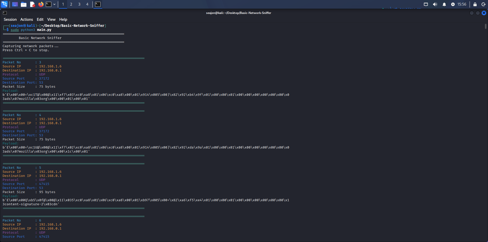

# 🛡️ Basic Network Sniffer


A Python-based Network Packet Sniffer developed using **Scapy**. The application captures live network traffic and displays useful packet information such as source and destination IP addresses, transport protocol, and payload preview.

This project was developed as part of a Cyber Security Internship to gain hands-on experience with packet capturing and network protocol analysis.

---

# Features

- Capture live network packets
- Detect TCP packets
- Detect UDP packets
- Detect ICMP packets
- Display Source IP
- Display Destination IP
- Display Protocol
- Display Packet Payload
- Beginner Friendly
- Lightweight

---

# Technologies Used

- Python 3
- Scapy
- Colorama
- Kali Linux

---

# Installation

Clone the repository

```bash
git clone https://github.com/Seajon2002/Basic-Network-Sniffer.git
```

Go to the project

```bash
cd Basic-Network-Sniffer
```

Install requirements

```bash
pip install -r requirements.txt
```

Run

```bash
sudo python3 main.py
```

---

# Project Structure

```
Basic-Network-Sniffer/

├── main.py
├── packet_sniffer.py
├── packet_analyzer.py
├── requirements.txt
├── README.md
├── screenshots/
└── sample_output/
```

---

# Sample Output

```
Packet Number : 1

Source IP      : 192.168.1.6

Destination IP : 192.168.0.1

Protocol        : TCP

Payload Preview:
b'.....'
```

---

# Screenshot




```
```

---

# Learning Outcomes

- Network Packet Analysis
- TCP/IP Fundamentals
- Packet Sniffing
- Scapy
- Kali Linux
- Cyber Security Basics

---

# Future Improvements

- Save packets into PCAP
- Export packets to CSV
- Packet Filtering
- Protocol Statistics
- CLI Arguments
- Real-time Dashboard

---

# License

MIT License

---

# Author

**Ektearul Haque**

Software Engineer | Cybersecurity Enthusiast

GitHub:
https://github.com/Seajon2002
